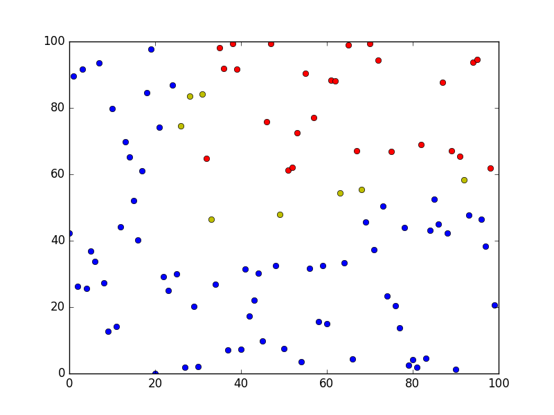

# random_dots_keras
Trying to learn Keras with a simple Neural Net on random plot data.

## The plot data
I generated simple random plot data that has red and blue dots. These dots are constrained to certain areas on an x,y grid. Blue will cover the majority of the graph compared to red but the dots are randomly placed inside their constrained grids.

The [blue_red_sample.csv](blue_red_sample.csv) file is used in training the model and the  [blue_red_sample_2.csv](blue_red_sample_2.csv) file is to be a second randomly generated plot to be used to compare how well the model handles unknown data.

## Computing the Model
This project was to learn more about Keras so I implemented a multilayer perceptron with Keras's Sequential model. The model has 3 Keras Dense layers with the input layer accepting 2 inputs, the x and y values from the plot, and the output layer outputing 1 value between 0.0 and 1.0, closer to 1 being blue and closer to 0 being red.

*The First Layer*
The first layer has 10 neurons which are initialized uniformly and uses a sigmoid acitvation function. I first tried using ReLU as the activation layer but found that sigmoid gave better results. I added a dropout of 0.4 to this layer.

*The Second Layer*
The second layer has 8 neurons which are initalized uniformly and uses a ReLU activation function. I added a dropout of 0.3 to this layer. This layer showed great improvement using ReLU as it's activation function rather than sigmoid.

*The Third Layer*
The third layer is the ouput layer and it has 1 neuron which is initialized uniformly and uses the sigmoid activation function. 

*Compiling the model*
Since the ouput layer is outputing 1 value between 0.0 and 1.0 I am using Binary cross entropy as my loss function and I use adam as my gradient optimizer.

## Testing the Model
I evaluate the model on the data that was used to train it to get the accuracy of the model. I then evaluate the model on the second set of data to see what it's accuracy is.

## Results
After the model has been trained and tested I print out the results of the model's predictions of the blue_red_sample.csv file to a file named br_results.txt. I then run the blue_red_graph.py which shows a graphical representation of the model's predictions versus the acutal results.

## Interpreting the Graph
The graph displays the dots in their correct coordinates and are colored either blue, red, magenta, or yellow. 

*Blue dots* mean a correctly guessed blue dot.

*Red dots* mean a correctly guessed red dot.

*Magenta dots* mean the model guessed blue but should have been a red dot.

*Yellow dots* mean the model guessed red but should have been a blue dot.

## Example Graph

